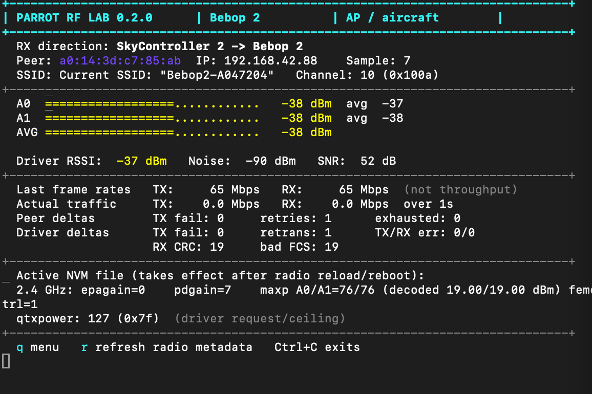
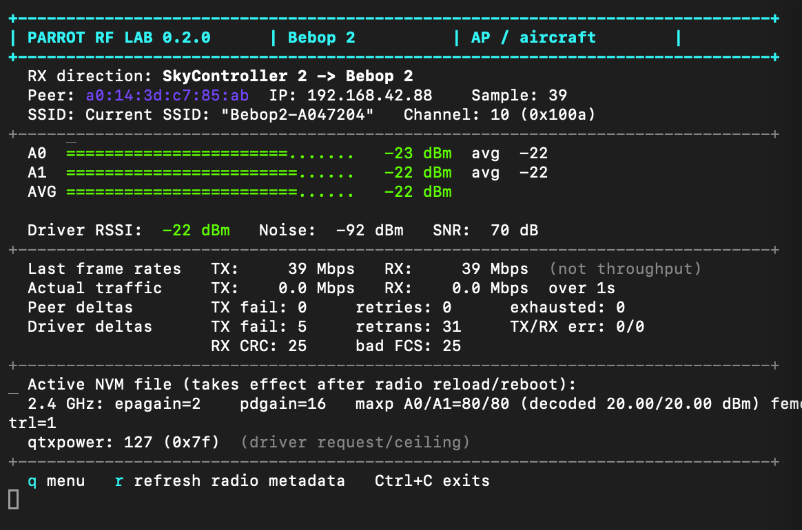
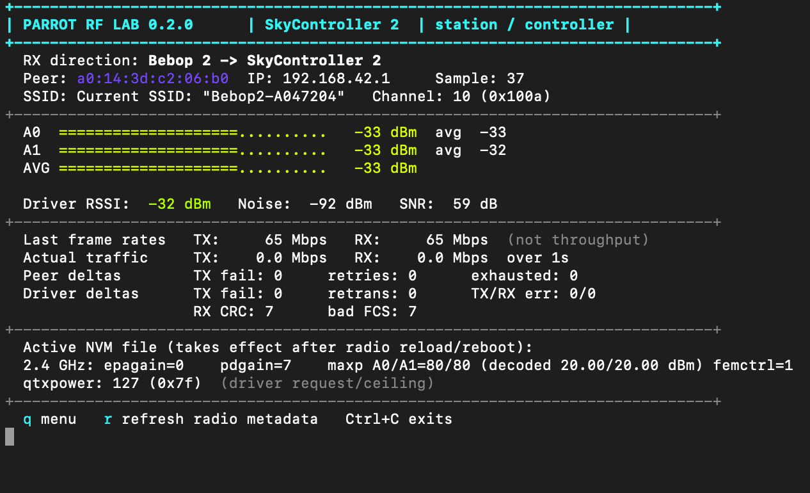
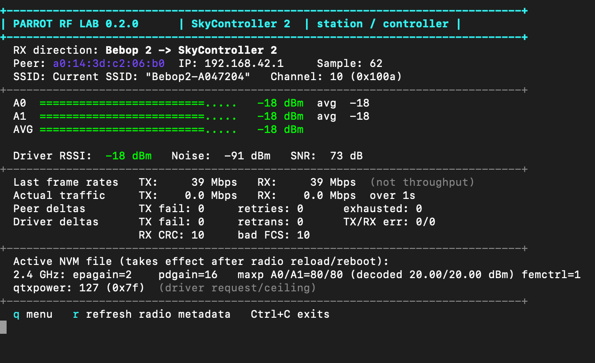

# Parrot Bebop 2 RF Lab

Open research and a BusyBox-native RF diagnostic tool for the Parrot Bebop 2 and SkyController 2.

Both devices contain a Broadcom BCM43526-family Wi-Fi radio, two RF chains, and Skyworks SKY85803 front-end modules. This project maps that stack, records controlled RF experiments, and provides one script that can monitor or carefully stage the relevant NVM settings on either endpoint.

**The demonstrated RF improvement is entirely software-configured:** it requires no soldering, disassembly, antenna replacement, external amplifier, or other physical modification. Additional cooling may be sensible during extended RF characterization, but it is optional and is not what produces the measured signal increase.

No Parrot firmware image, factory calibration dump, credential, serial number, or flight log is distributed here.

> [!CAUTION]
> The experimental RF profile can substantially increase transmitted power and may exceed the legal EIRP limit in your region. It has not yet been characterized for EVM, spectral mask, band-edge emissions, temperature, or long-duration duty cycle. Use a shielded or attenuated RF bench, preserve the factory NVM, and do not treat RSSI as a power meter.

## Result in one table

The strongest repeatable 2.4 GHz profile tested so far is:

```text
epagain2g=2
pdgain2g=16
maxp2ga0=80
maxp2ga1=80
```

At a fixed 5 m separation:

| Transmit direction | Stock RSSI | Modified RSSI | Observed change |
|---|---:|---:|---:|
| SkyController 2 -> Bebop 2 | -38 dBm | -22 dBm | +16 dB |
| Bebop 2 -> SkyController 2 | -33 dBm | -18 dBm | +15 dB |

## Fresh 5 m A/B captures

These four captures use the same channel, physical separation and antenna orientation. Both endpoints were stock for the baseline and both endpoints used the experimental profile for the modified run. Each image shows the **receiving** endpoint, incoming direction and that receiver's active NVM values; the stock `MAXP76`/`MAXP80` difference is therefore expected between the Bebop 2 and SC2 displays.

### SkyController 2 transmitting to Bebop 2

| Stock link — both endpoints stock | Modified link — both endpoints EPA2 / PD16 / MAXP80 |
|---|---|
|  |  |

### Bebop 2 transmitting to SkyController 2

| Stock link — both endpoints stock | Modified link — both endpoints EPA2 / PD16 / MAXP80 |
|---|---|
|  |  |

Those are receiver-reported link levels, not direct transmitter measurements. Primary-source cross-checking currently supports two different power quantities:

- approximately **0.12–0.25 W combined average modulated output** if the FEMs remain near their rated clean 802.11 output;
- approximately **0.4–0.7 W combined instantaneous/peak-envelope power**, consistent with the FCC peak tests and the direct RSSI extrapolation.

The project therefore does **not** describe the modification as a measured 600 mW average transmitter. Only a conducted measurement can settle average power, peak power and modulation quality separately. See [the estimate and its assumptions](docs/POWER_ESTIMATE.md).

The most important technical result is not the wattage estimate: it is the clean isolation of `epagain2g=2`, followed by the repeatable, non-monotonic interaction between `pdgain2g` and `maxp2ga*`.

## What the settings appear to do

| Field | Current interpretation | Evidence level |
|---|---|---|
| `epagain2g` | Selects the external-PA topology/calibration mode used by the PHY. Value `2` is decisive on this hardware. | Strong empirical result; exact encoding undocumented |
| `pdgain2g` | Selects the PA power-detector/TSSI gain regime. It changes the closed-loop calibration behavior rather than acting as a linear gain slider. | Strong interaction observed; exact BCM43526 encoding undocumented |
| `maxp2ga0/1` | Per-chain requested/calibrated maximum in quarter-dB units. `80` represents 20 dBm as a configuration input, not measured output. | Documented on related Broadcom/Cypress parts |
| `femctrl` | Selects a built-in FEM pin-control table. It is not an LNA on/off Boolean. | Datasheet and firmware-string evidence |
| `rxgains*` | Receive-path/eLNA model calibration. These were investigated but did not cause the demonstrated transmitter-side improvement. | Documented meaning and direction-isolated test |

Increasing numbers is not necessarily increasing power. `PD16/MAXP80` produced the strong link; `PD16/MAXP90` collapsed it to roughly -70 dBm at 5 m. That failure is evidence that the controls select a calibration envelope, not a simple volume control.

## Parrot RF Lab tool

[`tools/parrot_rf_lab.sh`](tools/parrot_rf_lab.sh) runs directly under the stock BusyBox `ash` on both products. It requires no Python or package installation on the device.

It provides:

- a live, in-place dashboard with color-graded A0/A1 signal bars;
- per-chain last/average RSSI, noise and SNR;
- TX/RX PHY rates and actual byte-counter throughput as separate values;
- live retry, failure, CRC and FCS deltas;
- active-file versus runtime NVM values;
- labeled 38-column CSV experiment logs in FTP-visible storage;
- read-only radio snapshots;
- staged NVM editing with a diff, explicit confirmation, timestamped backup and verified rollback;
- device-specific stock restoration presets.

The same file is used on both devices:

```sh
# Bebop 2
lftp -e 'put tools/parrot_rf_lab.sh -o internal_000/parrot_rf_lab.sh; bye' \
  ftp://192.168.42.1

# SkyController 2
lftp -e 'put tools/parrot_rf_lab.sh -o internal_000/parrot_rf_lab.sh; bye' \
  ftp://192.168.42.88
```

Run it on the Bebop:

```sh
sh /data/ftp/internal_000/parrot_rf_lab.sh menu
```

Run it on the SkyController:

```sh
sh /data/lib/ftp/internal_000/parrot_rf_lab.sh menu
```

Monitoring is read-only. To use the NVM editor on **either** device, first run `mount -o remount,rw /` in that device's shell; after applying and leaving the editor, run `sync` and `mount -o remount,ro /` before rebooting.

Detailed usage and recovery instructions are in [the tool manual](tools/PARROT_RF_LAB.md).

For a complete stock-to-modified reproduction—including backups, the exact per-device values, reboot/runtime verification, bidirectional 60-second logs, CSV retrieval and rollback—follow [Reproducing the RF results](docs/REPRODUCING_RESULTS.md).

## Native macOS HUD — under development

> [!WARNING]
> The macOS application is an early bench preview, not a usable flight display. Direct SkyController 2 USB transport is not implemented, and live video does not currently work. Its Telnet telemetry requires an existing IP route to the controller, which is unsuitable once the aircraft and controller leave the Mac's network range.

[`mac/ParrotLab`](mac/ParrotLab) contains the first native Parrot Lab application for Apple-silicon Macs. It connects directly to the SkyController 2's Telnet telemetry, parses the existing `mppd`/Broadcom status feed and presents flight attitude, altitude, RF-chain signal, noise, SNR, link quality, SC2 health and video transport statistics in a graphical HUD.

It also includes a sanitized hardware-free replay and experimental SC2 video code. Version 0.1 is deliberately read-only: it does not write RF NVM, Dragon video options or flight settings. The attempted IP restream path is not the USB `libmux` transport used by FreeFlight and is retained only as development scaffolding.

Build the double-clickable app with:

```sh
cd mac/ParrotLab
./scripts/build-app.sh
```

See the [Parrot Lab macOS guide](mac/ParrotLab/README.md) for operation, current limitations and the planned progression from RF utility to unified BB2/SC2 suite.

## Evidence

- [Complete experiment record](docs/EXPERIMENTS.md)
- [Step-by-step replication guide](docs/REPRODUCING_RESULTS.md)
- [Stock BB2 versus SC2 RF comparison](docs/STOCK_COMPARISON.md)
- [RF parameter analysis](notes/bcm43526-rf-experiment-notes.md)
- [Power estimate and uncertainty](docs/POWER_ESTIMATE.md)
- [Repeatable A/B protocol](docs/TEST_PROTOCOL.md)
- [Device access and important paths](docs/DEVICE_ACCESS.md)
- [Bebop 2 firmware map](notes/bebop2-firmware-map.md)
- [SkyController 2 firmware map](notes/skycontroller2-firmware-map.md)
- [Bebop video and SC2 restream map](notes/bebop2-video-streaming.md)

The 52 m test remained around -42 to -45 dBm on the Bebop side and approximately -36 to -48 dBm across the SC2 chains. A later 650 m flight, with the aircraft about 14 m below the launch elevation and partial terrain/tree obstruction, retained three to four indicated bars with responsive controls and no visible video stutter. The 650 m observation is useful field evidence but was not accompanied by a raw RF Lab CSV, so it is recorded as qualitative rather than laboratory data.

## Repository layout

```text
tools/parrot_rf_lab.sh           unified on-device dashboard/editor/logger
tools/bebop_signal_logger.py     optional Mac-side Telnet logger
tools/extract_plf.py             reproducible PLF filesystem extractor
tools/tests/rf_lab_fixture/      sanitized parser fixture
mac/ParrotLab/                   native macOS video HUD and SC2 client
docs/                            experiment, access and measurement documentation
notes/                           detailed firmware and BCM43526 research maps
```

## Project status

This is experimental reverse-engineering work, not a finished power modification kit. The next decisive measurements are per-chain conducted power, EVM, spectrum mask and band-edge emissions at fixed channel/rate, followed by thermal measurements under a controlled duty cycle.

Contributions with BCM43526 documentation, sanitized stock NVM comparisons, calibrated RF measurements, or repeatable test logs are very welcome. See [CONTRIBUTING.md](CONTRIBUTING.md).

## Acknowledgements

This work was partly inspired by the community-authored [*An unofficial Bebop drone hacking guide 1.7.2*](https://fargesportfolio.com/wp-content/uploads/2018/01/BeebopHackingGuide1_7_2.pdf). Its unusually thorough explanation of the Bebop's Linux filesystem, Telnet/FTP access, backup discipline and accessible developer tooling showed how open the platform really was and encouraged me to begin experimenting with the Bebop 2. It remains excellent background material for practically any Bebop software project.

The guide did not provide the RF profile or code published here; credit is for foundational documentation and inspiration. Additional acknowledgements and prior-art context are in [ACKNOWLEDGEMENTS.md](ACKNOWLEDGEMENTS.md).

## License and trademarks

Original scripts and documentation in this repository are released under the [MIT License](LICENSE). Parrot, Bebop, Broadcom, Infineon, Skyworks and their marks belong to their respective owners. This independent project is not affiliated with or endorsed by them.
